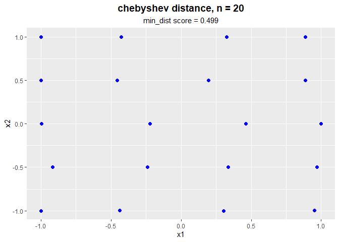
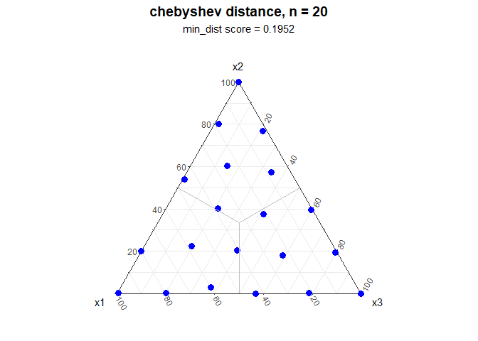
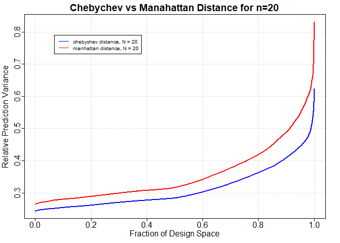

<!-- README.md is generated from README.Rmd. Please edit that file -->

# DoEAna

<!-- badges: start -->
<!-- badges: end -->

The goal of DoEAna is to visualize the results of research regarding
space-filling experimental designs. The package has a prepared data set
“DoEAna.rda” with designs for comparison. In the dataset, you can see
how designs were generated on two different geometries: hypercube and
simplex. They also differ by the distance measure used: Manhattan,
Chebyshev, and Euclidean. Finally, they differ by the number of design
points: 10, 20, and 30. The user can use this package to compare how
these different experiment features affect a designs performance.

## Installation

You can install the development version of DoEAna from
[GitHub](https://github.com/) with:

``` r
# install.packages("devtools")
devtools::install_github("DianaF65/DoEAna")
```

## Example

This is a basic example which shows you how to solve a common problem:

``` r
library(DoEAna)

# select designs on the hypercube or simplex
my_design_hyper <- select_design(geometry = "hypercube", distance = "chebyshev", n = 20)
my_design_sim <- select_design(geometry = "simplex", distance = "chebyshev", n = 20)

# show the design matrices
print_design(my_design_hyper)
#>            [,1]      [,2]
#>  [1,] -0.241240 -0.497962
#>  [2,]  0.997182  0.001212
#>  [3,]  0.195633  0.500962
#>  [4,] -0.914856 -0.497256
#>  [5,] -0.436894 -0.997358
#>  [6,]  0.971241 -0.498390
#>  [7,] -0.999211 -0.999125
#>  [8,]  0.951683 -0.997436
#>  [9,] -0.223096  0.001856
#> [10,]  0.461232  0.001846
#> [11,]  0.334787 -0.498980
#> [12,] -0.425508  0.999994
#> [13,]  0.323609  0.999992
#> [14,] -0.457074  0.501036
#> [15,]  0.304456 -0.999984
#> [16,] -0.999801  0.501026
#> [17,] -0.995570  0.002004
#> [18,]  0.887859  0.500900
#> [19,] -0.999597  0.999997
#> [20,]  0.888506  0.999958
print_design(my_design_sim)
#>           [,1]     [,2]     [,3]
#>  [1,] 0.009484 0.194663 0.795853
#>  [2,] 0.582070 0.224648 0.193282
#>  [3,] 0.245236 0.603631 0.151133
#>  [4,] 0.600517 0.029450 0.370033
#>  [5,] 0.795879 0.002175 0.201946
#>  [6,] 0.000000 1.000000 0.000000
#>  [7,] 0.992595 0.001118 0.006287
#>  [8,] 0.182242 0.801162 0.016596
#>  [9,] 0.214295 0.000764 0.784941
#> [10,] 0.430589 0.000007 0.569404
#> [11,] 0.209907 0.376617 0.413475
#> [12,] 0.384869 0.402233 0.212899
#> [13,] 0.006165 0.396049 0.597786
#> [14,] 0.453662 0.538201 0.008138
#> [15,] 0.230711 0.181308 0.587981
#> [16,] 0.019140 0.767096 0.213764
#> [17,] 0.800675 0.199325 0.000000
#> [18,] 0.081351 0.571904 0.346745
#> [19,] 0.405351 0.204038 0.390611
#> [20,] 0.000000 0.000449 0.999551

# plot the designs
par(mfrow = c(1, 2))
plot_design(my_design_hyper)
```



``` r
plot_design(my_design_sim)
#> Registered S3 methods overwritten by 'ggtern':
#>   method           from   
#>   grid.draw.ggplot ggplot2
#>   plot.ggplot      ggplot2
#>   print.ggplot     ggplot2
```



``` r
# compare across different distance measures with relative efficiency on the 
# hypercube
my_designM_H <- select_design(geometry = "hypercube",
                            distance = "manhattan", n = 20)
my_designE_H <- select_design(geometry = "hypercube",
                            distance = "euclidean", n = 20)
my_designC_H <- select_design(geometry = "hypercube",
                            distance = "chebyshev", n = 20)

relative_efficiency(m_row = my_designM_H, e_row = my_designE_H, 
                    c_row = my_designC_H)
#>       M Best  E Best  C Best
#> M(x) 100.000  77.529  71.639
#> E(x)  91.230 100.000  92.378
#> C(x)  69.923  76.814 100.000
```

What is special about using `README.Rmd` instead of just `README.md`?
You can include R chunks like so:

``` r
# compare across different distance measures with relative efficiency on the 
# simplex
my_designM_S <- select_design(geometry = "simplex",
                            distance = "manhattan", n = 20)
my_designE_S <- select_design(geometry = "simplex",
                            distance = "euclidean", n = 20)
my_designC_S <- select_design(geometry = "simplex",
                            distance = "chebyshev", n = 20)

relative_efficiency(m_row = my_designM_S, e_row = my_designE_S, 
                    c_row = my_designC_S)
#>       M Best  E Best  C Best
#> M(x) 100.000  98.665  99.376
#> E(x)  88.071 100.000  88.735
#> C(x) 100.628  99.285 100.000
```

``` r
# Compare relative prediction variance across designs using FDS plots
fds_plot(design1 = my_designC_H, design2 = my_designM_H, 
         Main = "Chebychev vs Manahattan Distance for n=20")
```


